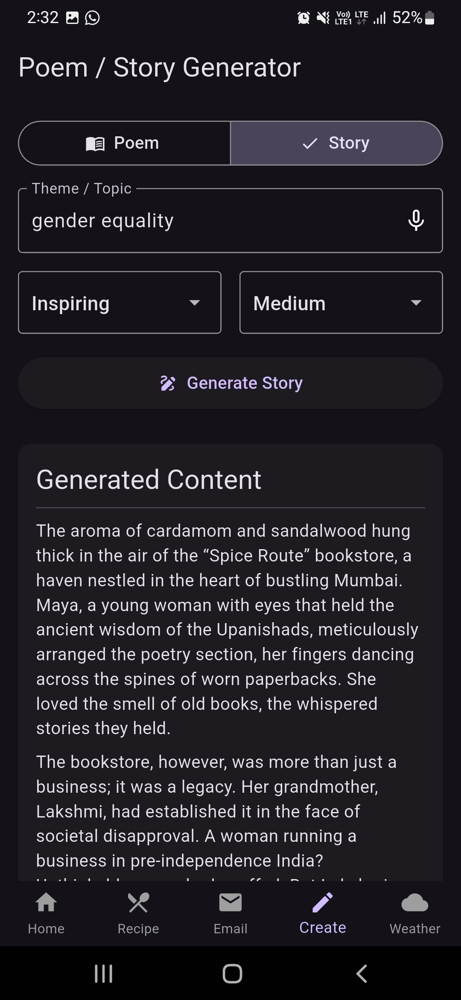

# GenieBox 🧞📦
<!-- 
**Tagline:** Your Pocket Assistant for Creativity, Clarity & Everyday Help. -->


GenieBox is a multi-functional AI-powered mobile application built with Flutter. It combines productivity tools, creative generators, and everyday utilities into one handy app. Powered by the Google Gemini API for generative tasks and WeatherAPI.com for real-time weather data.

## ✨ Features

GenieBox offers a suite of tools to assist you in various tasks:

*   **🏠 Home Dashboard:**
    *   Quick access tiles for all major features.
    *   Personalized greeting (e.g., "Good Morning!").
    *   "Quote of the Day" for inspiration.
    *   Easy theme switching (Light/Dark).
*   **🍲 Recipe Creator:**
    *   Generate recipes based on a list of ingredients you have.
    *   Specify optional cuisine types and dietary preferences.
    *   Get a full recipe with title, ingredients, and step-by-step instructions.
    *   "Surprise Me" button for random recipe ideas.
    *   Options to copy or regenerate recipes.
*   **✍️ Email Response Generator:**
    *   Paste or type an email/message you need to reply to.
    *   Choose the desired tone (Formal, Casual, Apologetic, Assertive, Friendly).
    *   Toggle between "Quick Preview" and "Detailed Response".
    *   Get a polished, editable reply suggestion.
    *   Options to regenerate or modify the tone.
*   **📝 Poem/Story Generator:**
    *   Generate original poems or stories.
    *   Specify the theme/topic, desired mood (Happy, Sad, Dark, etc.), and length (Short, Medium, Long).
    *   Options to save, share, copy, or regenerate the creative content.
*   **🌦️ Weather Page:**
    *   Get real-time weather conditions (temperature, wind, humidity, etc.).
    *   Search for weather by city name.

## 📸 Screenshots

<!-- *(**Important:** Replace these placeholders with actual links to your screenshots or GIFs!)* -->

| Home Page                 | Recipe Creator            | Email Reply               |
| :------------------------ | :------------------------ | :------------------------ |
|  |  |  |

| Story/Poem Generator      | Weather Page              | Theme Toggle              |
| :------------------------ | :------------------------ | :------------------------ |
|  |  |  |

<!-- *(Tip: Use a tool like ScreenToGif or Kap to create animated GIFs showing features in action.)* -->

## 🛠️ Tech Stack

*   **Framework:** Flutter (v3.29.2)
*   **Language:** Dart
*   **State Management:** Riverpod
*   **AI Backend:** Google Gemini API
*   **Weather Backend:** WeatherAPI.com

## 🚀 Getting Started

Follow these instructions to get a copy of the project up and running on your local machine for development and testing purposes.

<!-- ### Prerequisites

*   Flutter SDK installed (check version compatibility). [Flutter Installation Guide](https://docs.flutter.dev/get-started/install)
*   An editor like VS Code or Android Studio.
*   An emulator or physical device to run the app.
*   API Keys (see Configuration below). -->

### Installation

1.  **Clone the repository:**
    ```bash
    git clone https://github.com/Shaunm1724/GenieBox.git    
    cd GenieBox
    ```
2.  **Install dependencies:**
    ```bash
    flutter pub get
    ```

### Configuration - API Keys (Important!)

This project requires API keys from Google Gemini and WeatherAPI.com to function correctly. **These keys are NOT included in the repository for security reasons.**

You need to provide them using Flutter's `--dart-define` build arguments:

1.  **Google Gemini API:**
    *   Get your API key from [Google AI Studio](https://aistudio.google.com/app/apikey).
2.  **WeatherAPI.com:**
    *   Sign up and get your API key from [WeatherAPI.com](https://www.weatherapi.com/).

<!-- **Store these keys securely.** Do *not* commit them directly into your code. -->

### Usage

To run the app, use the `flutter run` command and provide the API keys via `--dart-define`:

```bash
flutter run \
  --dart-define=GEMINI_API_KEY=YOUR_GEMINI_API_KEY \
  --dart-define=WEATHER_API_KEY=YOUR_WEATHERAPI_KEY
```